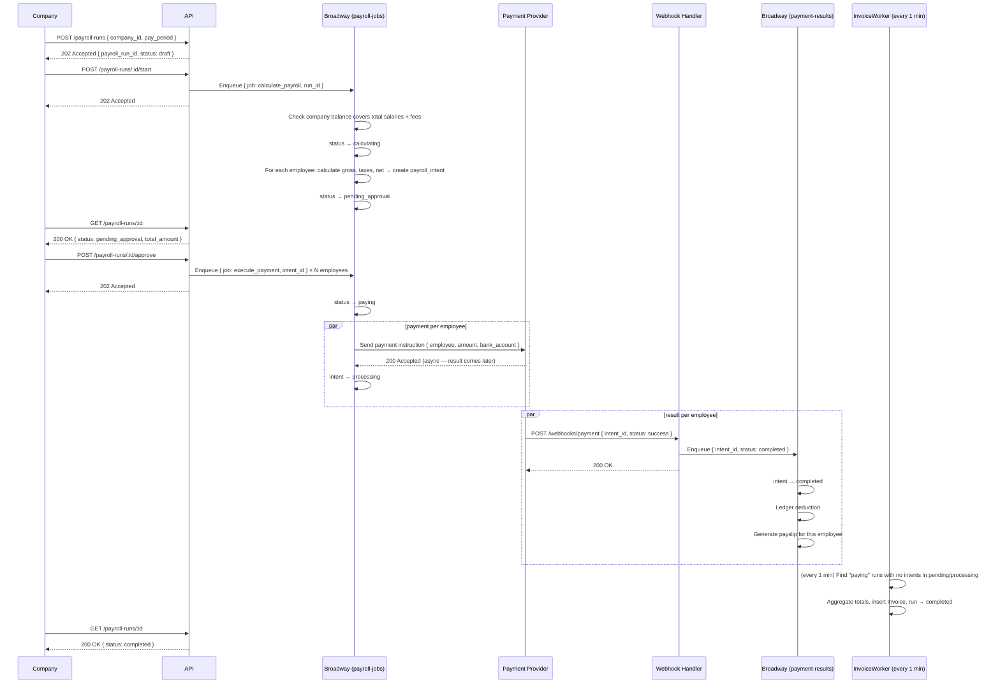
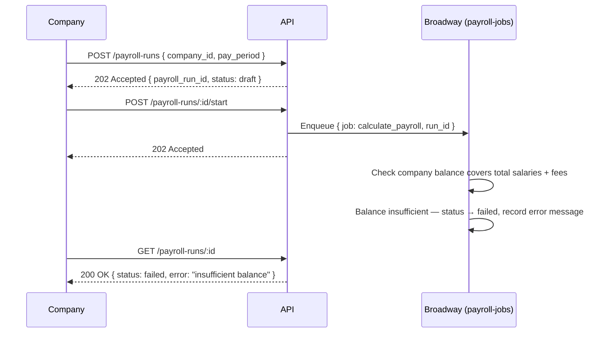
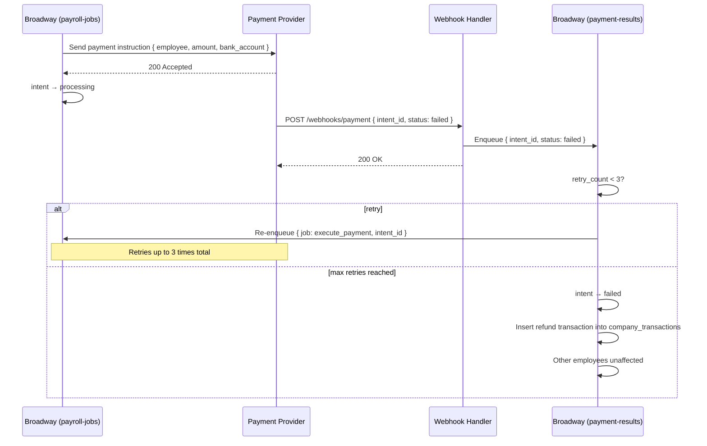
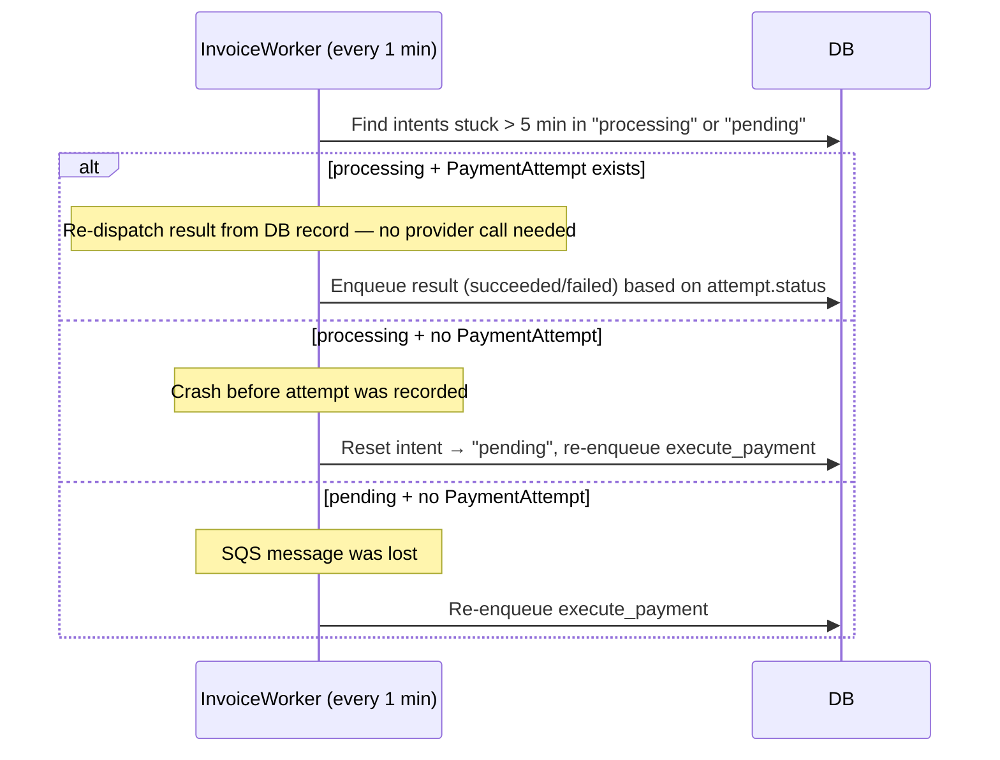

# Sequence Diagrams

## 1. Company initiates a payroll run (happy path)

## 2. Insufficient balance

## 3. Payment failure with retry

## 4. Reconciliation (stale processing intent)

Runs every 1 minute inside `InvoiceWorker`. Resolves stuck intents using DB records only —
no provider API call is made. The cutoff for "stuck" is 5 minutes (`updated_at < now() - 5min`).

