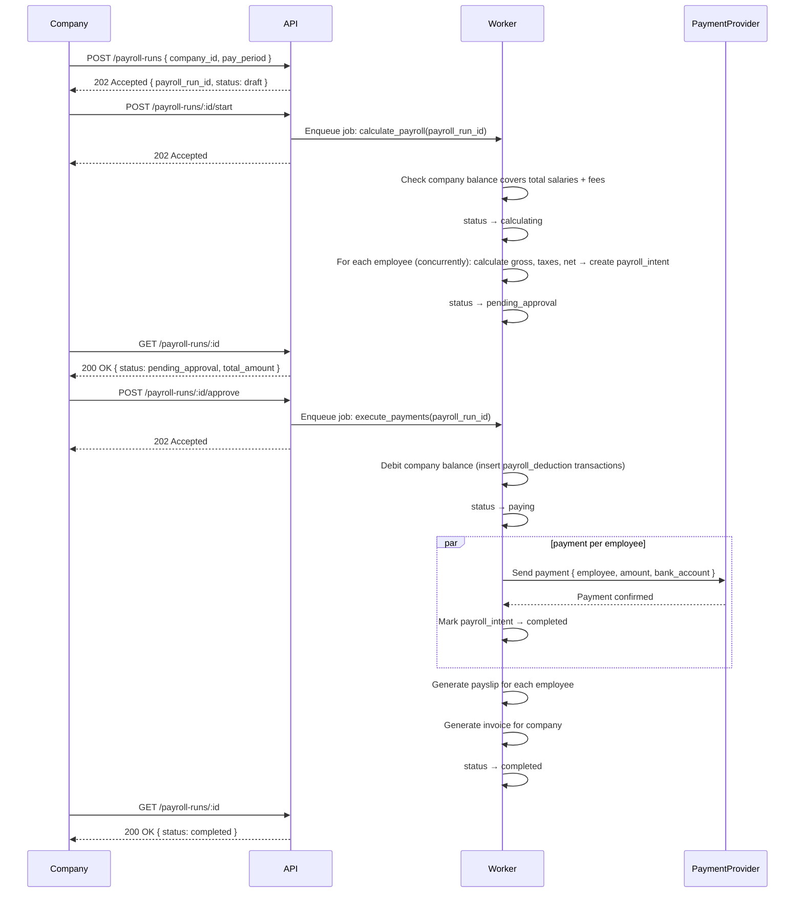
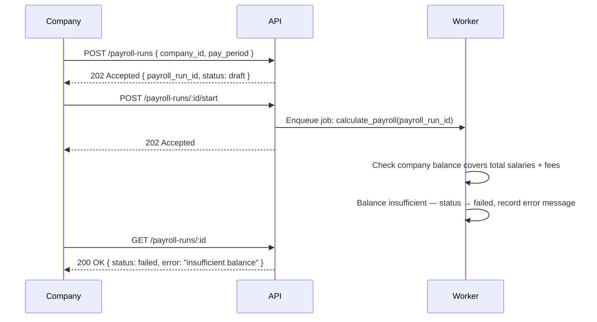
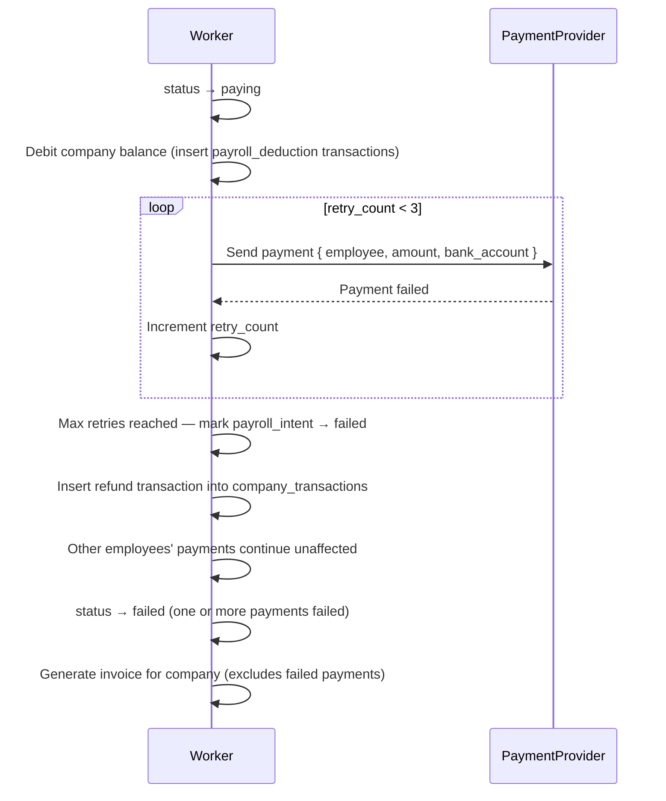

# Sequence Diagrams

## 1. Company initiates a payroll run (happy path)

```mermaid
sequenceDiagram
    participant Company
    participant API
    participant Worker
    participant PaymentProvider

    %% Company creates the payroll run
    Company->>API: POST /payroll-runs { company_id, pay_period }
    API-->>Company: 202 Accepted { payroll_run_id, status: draft }

    %% Company triggers calculation — API hands off immediately to worker
    Company->>API: POST /payroll-runs/:id/start
    API->>Worker: Enqueue job: calculate_payroll(payroll_run_id)
    API-->>Company: 202 Accepted

    %% Worker runs in the background
    Worker->>Worker: Check company balance covers total salaries + fees
    Worker->>Worker: status → calculating
    Worker->>Worker: For each employee (concurrently): calculate gross, taxes, net → create payroll_intent
    Worker->>Worker: status → pending_approval

    %% Company polls until status changes
    Company->>API: GET /payroll-runs/:id
    API-->>Company: 200 OK { status: pending_approval, total_amount }

    %% Company approves
    Company->>API: POST /payroll-runs/:id/approve
    API->>Worker: Enqueue job: execute_payments(payroll_run_id)
    API-->>Company: 202 Accepted

    %% Worker executes payments concurrently
    Worker->>Worker: Debit company balance (insert payroll_deduction transactions)
    Worker->>Worker: status → paying
    par payment per employee
        Worker->>PaymentProvider: Send payment { employee, amount, bank_account }
        PaymentProvider-->>Worker: Payment confirmed
        Worker->>Worker: Mark payroll_intent → completed
    end

    %% Generate documents and close the run
    Worker->>Worker: Generate payslip for each employee
    Worker->>Worker: Generate invoice for company
    Worker->>Worker: status → completed

    %% Company polls final status
    Company->>API: GET /payroll-runs/:id
    API-->>Company: 200 OK { status: completed }
```

## 2. Insufficient balance

```mermaid
sequenceDiagram
    participant Company
    participant API
    participant Worker

    Company->>API: POST /payroll-runs { company_id, pay_period }
    API-->>Company: 202 Accepted { payroll_run_id, status: draft }

    Company->>API: POST /payroll-runs/:id/start
    API->>Worker: Enqueue job: calculate_payroll(payroll_run_id)
    API-->>Company: 202 Accepted

    Worker->>Worker: Check company balance covers total salaries + fees
    Worker->>Worker: Balance insufficient — status → failed, record error message

    Company->>API: GET /payroll-runs/:id
    API-->>Company: 200 OK { status: failed, error: "insufficient balance" }
```

## 3. Payment failure with retry

```mermaid
sequenceDiagram
    participant Worker
    participant PaymentProvider

    %% Picks up from happy path: run is approved, status → paying
    %% Worker processes each employee — this shows one failing payment

    Worker->>Worker: status → paying
    Worker->>Worker: Debit company balance (insert payroll_deduction transactions)

    loop retry_count < 3
        Worker->>PaymentProvider: Send payment { employee, amount, bank_account }
        PaymentProvider-->>Worker: Payment failed
        Worker->>Worker: Increment retry_count
    end

    Worker->>Worker: Max retries reached — mark payroll_intent → failed
    Worker->>Worker: Insert refund transaction into company_transactions
    Worker->>Worker: Other employees' payments continue unaffected

    %% Once all intents are settled
    Worker->>Worker: status → failed (one or more payments failed)
    Worker->>Worker: Generate invoice for company (excludes failed payments)
```