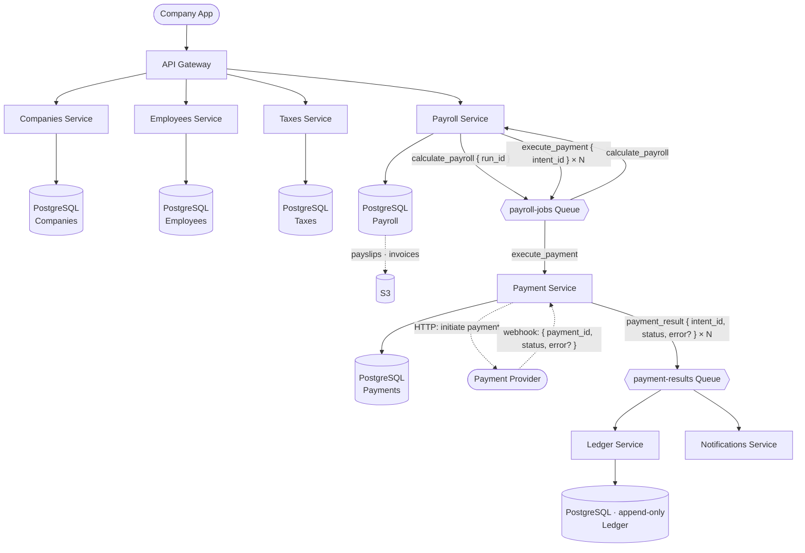
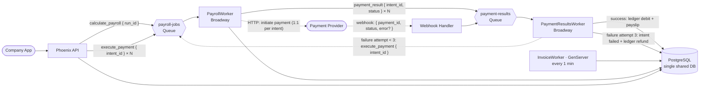

# Global Payroll System — Architecture

---

## Design Architecture (Full Scale)

This is the target architecture for a production-grade globally scalable system.




### Services


| Service                   | Responsibility                                               | Database        |
| ------------------------- | ------------------------------------------------------------ | --------------- |
| **API Gateway**           | Routes requests, auth, rate limiting                         | None            |
| **Companies Service**     | Company registration, status management                      | PostgreSQL      |
| **Employees Service**     | Employee profiles, payment methods                           | PostgreSQL      |
| **Taxes Service**         | Country tax rules lookup                                     | PostgreSQL      |
| **Payroll Service**       | Payroll run orchestration, payslips, invoices                | PostgreSQL + S3 |
| **Payment Service**       | Payment execution, retries, webhook handling, reconciliation | PostgreSQL      |
| **Ledger Service**        | Append-only company_transactions, balance computation        | PostgreSQL      |
| **Notifications Service** | Notifies companies of run status changes                     | None            |


### Storage

- **PostgreSQL** — all structured data (per service in full scale, shared in implementation)
- **S3** — invoice and payslip PDF files. Accessed via pre-signed URLs (no CDN — private documents)

---

## Implementation Architecture (What We Actually Build).




### Queue Message Design

### State Machines

#### PayrollRun

```
draft ──► calculating ──► pending_approval ──► approved ──► paying ──► completed
                                                                  └──► failed
```


| Transition                       | Trigger                                                              |
| -------------------------------- | -------------------------------------------------------------------- |
| `draft → calculating`            | Broadway picks up `calculate_payroll`, balance check passes          |
| `calculating → pending_approval` | All intents inserted successfully                                    |
| `pending_approval → approved`    | `approve_run` called                                                 |
| `approved → paying`              | Immediately after approved, in the same `approve_run` call           |
| `paying → completed`             | `InvoiceWorker` detects no intents left in `pending` or `processing` |
| `any → failed`                   | Balance check fails, or run explicitly cancelled                     |


#### PayrollIntent

```
pending ──► processing ──► completed
                      └──► pending   (retry, retry_count < 3)
                      └──► failed    (retry_count = 3)
```


| Transition               | Trigger                                                       |
| ------------------------ | ------------------------------------------------------------- |
| `pending → processing`   | `execute_payment` starts — intent locked before provider call |
| `processing → completed` | `on_success` — ledger deduction + payslip created atomically  |
| `processing → pending`   | `on_failure` — re-enqueued to `payroll-jobs` for retry        |
| `processing → failed`    | `on_max_retries` — ledger refund issued                       |


---

### Complete Message Flow

#### `calculate_payroll` message

```
POST /start
  └─ enqueue {"job":"calculate_payroll","run_id":"X"} → payroll-jobs

PayrollWorker (Broadway)
  └─ Payrolls.calculate_run("X")
       ├─ validate: status is "draft" or "calculating"
       ├─ compute total net salaries + platform fees
       ├─ check company balance ≥ total
       ├─ run → "calculating"
       ├─ delete any existing intents (safe to retry)
       ├─ insert N intents in chunks of 500 (bulk insert, parallel per chunk)
       └─ run → "pending_approval"
                                        ← Broadway acks message (deleted from SQS)
```

#### `execute_payment` message

```
POST /approve
  └─ approve_run()
       ├─ run → "approved" → "paying"
       └─ Task.start (async) → batch-enqueue N × {"job":"execute_payment","intent_id":"Y"}

PayrollWorker (Broadway) — N messages processed in parallel
  └─ Payments.execute_payment("Y")
       ├─ guard: already settled? → ack and stop
       ├─ check existing PaymentAttempt (idempotency on redelivery)
       ├─ intent → "processing", save idempotency_key
       ├─ MockProvider.call() → {:ok, provider_id} | {:error, reason}
       ├─ record PaymentAttempt (succeeded | failed)
       ├─ save provider_payment_id on intent
       └─ enqueue {"intent_id":"Y","status":"succeeded|failed"} → payment-results
                                        ← Broadway acks message

PaymentResultsWorker (Broadway)
  └─ Payments.process_result(event)
       ├─ on "succeeded":
       │    └─ DB transaction:
       │         ├─ lock intent (FOR UPDATE)
       │         ├─ intent → "completed"
       │         ├─ Ledger.payroll_deduction()
       │         └─ insert Payslip
       └─ on "failed":
            ├─ retry_count < 3 → intent → "pending", re-enqueue execute_payment
            └─ retry_count = 3 → intent → "failed", Ledger.refund()

InvoiceWorker (every 1 minute)
  └─ close_completed_runs()
       └─ finds "paying" runs with no intents in "pending" or "processing"
            └─ FOR UPDATE SKIP LOCKED (safe for multiple nodes)
                 ├─ aggregate completed intent totals
                 ├─ insert Invoice
                 └─ run → "completed"
```

#### Reconciliation (safety net, every 1 minute)

```
InvoiceWorker → Payments.reconcile_stuck_intents()

Case 1 — intent "processing", PaymentAttempt exists but result never reached payment-results:
  └─ re-dispatch result from the attempt record (no provider call)

Case 2 — intent "processing", no PaymentAttempt (crash between status update and attempt record):
  └─ reset intent → "pending", re-enqueue execute_payment

Case 3 — intent "pending" for 5+ minutes, no PaymentAttempt (SQS message lost):
  └─ re-enqueue execute_payment
```

---

### Why the webhook only enqueues

Real payment providers (Wise, Stripe Payouts) expect a `200` response within ~5 seconds or they
retry the webhook. Doing DB writes inside the request risks timeouts under load. The webhook
handler only enqueues the result to `payment-results` and returns immediately — `PaymentResultsWorker`
does the actual work.

### Stack


| Component                      | Technology                              |
| ------------------------------ | --------------------------------------- |
| Web framework                  | Phoenix                                 |
| Queue consumer                 | Broadway                                |
| Queue (local dev)              | floci (SQS-compatible)                  |
| Queue (production)             | AWS SQS                                 |
| Database                       | PostgreSQL (single instance)            |
| Reconciliation + invoice close | `InvoiceWorker` GenServer (every 1 min) |


### Why this still works at scale later

- Module boundaries in code map 1:1 to the microservices in the design diagram
- When you need to split services, each Phoenix context becomes its own app
- Broadway consumers already behave like independent workers — scaling them is additive
- The queue (SQS via floci locally, real SQS in production) is the same interface
- `payroll-jobs` maps to the Payroll→Payment SQS in the full-scale design
- `payment-results` maps to the Payment→Ledger/Notifications SQS in the full-scale design

---

## On Event Sourcing

**Should we switch to full event sourcing?**

No — and here's why:

Our system already uses event sourcing **where it matters most**: the financial ledger.
`company_transactions` is an append-only event log. The balance is derived by replaying
those events. That IS event sourcing for money movement.

Full event sourcing for the entire system would mean:

- No `payroll_runs.status` column — instead replay `PayrollCreated`, `PayrollStarted`,
`PayrollCalculated`, `PayrollApproved`, `PaymentExecuted`... to derive current state
- Requires CQRS + read projections (a separate read model rebuilt from events)
- Queries become complex — "what is the current status of this run?" requires replaying history

**The trade-off:**

- Full event sourcing gives perfect audit history and time-travel debugging
- But adds significant complexity — especially for a system where current state
(status, balance) is what clients query most

**Our approach is the right balance:**

- Ledger = event sourced (financial audit trail for free)
- Payroll run = state machine with timestamps (traceable, not full event sourcing)
- Payment intents = individual records with retry_count and error (auditable)

This is how most fintech systems work in practice.
Full event sourcing is more common in systems where replaying history is a core feature
(e.g. accounting systems, blockchain).